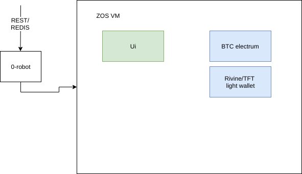
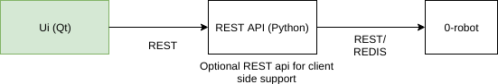

# Atomic Exchange version 1

Starting with version 1, the Atomic Exchange will be useable by all users like any other exchange. This version will include full Jumpscale integration, light wallets and a global orderbook.

## Jumpscale

### Priority one
For integration with Jumpscale these are the requirements:

- TFT light wallet integration [More info](https://github.com/Jumpscale/lib9/tree/development/JumpScale9Lib/clients/rivine#how-to-use-atomicswap)
- BTC Electrum atomic swap integration [More info/source code](https://github.com/rivine/atomicswap)
- Automated, decentralized atomic swap from Jumpscale
  - Current implementation is not decentralized, both parties should trust one script [More info](https://github.com/Jumpscale/lib9/tree/development/JumpScale9Lib/tools/atomicswap)
  - Atomic swap implementation can be based on the current one from v0.1 [Source code](https://github.com/rivine/AtomicExchange.Scripts)
- Provisioning TFT/BTC wallets and using the decentralized atomic swap SAL should be possible from 0-robot api's using new templates

- Following functionality should also be provided by the 0-robot templates:
  - recover <seeds>
  - seeds: Return JSON object with: {seeds: seeds}
  (- syncstatus Return JSON object with: {sync: percentageValue})
  - balance 	Return JSON object with: {balance: value}
  - address: Return JSON object with: 	{address: address}
  (- confirmations <tx_id> Return JSON object with: {tx:{ txFound: bool confirmations: int }})

### Priority two
 - AtomicExchange UI should also be useable/deployable in Jumpscale
 
### Architecture
 
 
[Follow up here](https://docs.greenitglobe.com/gig/org_development/issues/91)

 ## UI

The UI will contain an orderbook and created based on our [mockups](https://tinyurl.com/atomicExchange). Architecture will differ in the fact that every call will use the Jumpscale/0-robot functionality providing full compatibility with the ThreeFold grid.

Extra REST api so the possibility to build an alternative/future html/js application. Jimber believes html applications are the way to go in the long run.

The REST api will be built using Python and will contain following endpoints:

- Mastercontainer endpoints:
  - GET /container: GETs existing or new container for the user
  - GET /{cur}/balance: GETs balance for a specific currency
  - GET /{cur}/address: GETs a new address for the wallet
  - GET /{cur}/wallet: GETs key + url for download of wallet backup
  - GET /POST/wallet: POSTs { key : "key", file : "base64encodedwalletinfo" }
  - GET /orders: GETs all orders
  - POST /orders: POSTs { "CurrencyBuy" : "{curb}", "CurrencySell" : "{curs}", AmountBuy : "{amountbuy}", AmountSell:"{amountsell}"
  - GET /orders/{Id}: GET specific order

The UI is described using following mockups: 

https://app.moqups.com/kristof.vanstappen@jimber.org/LB0zbckZDG/view/page/ac131798e

## Orderbook
TBD
